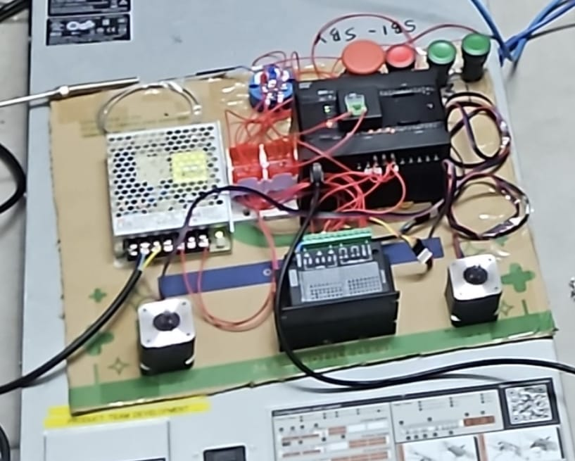

# PLC System

## System Overview
The PLC System utilizes a Node-RED SCADA Server that communicates with an Omron CP2E PLC over Ethernet. The Omron PLC acts as the central controller for the field instrumentation, processing inputs from push buttons, an emergency stop, and a PT100 temperature sensor, while driving NEMA 17 stepper motors via TB6600 motor drivers.

## System Topology
Node-RED SCADA Server -> Omron PLC -> (Transmitter, E-Stop Button, Safety Reset Button, Motor Drivers, Motor 1 Push Button, Motor 2 Push Button, Temperature Sensor, Stepper Motors)

## Components Used
* AC Power Cable
* Mean Well PSU
* VCC Bus Bar
* GND Bus Bar
* Omron CP2E PLC
* XB7-EA31 Push Button (Green Motor 1, Green Motor 2, Red Safety Reset)
* XB2BS542C Emergency Button
* PT100 Transmitter
* CP1W-ADB21 Option Board
* TB6600 Driver (x2)
* PT100 Sensor Probe
* NEMA 17 Motor (x2)
* SCADA Server (PC)

## Wiring Table

### 1. Power
| SOURCE COMPONENT | SOURCE TERMINAL | DESTINATION COMPONENT | DESTINATION TERMINAL |
| :--- | :--- | :--- | :--- |
| AC Power Cable | Live (Brown or Black wire) | Mean Well PSU | L screw |
| AC Power Cable | Neutral (Blue wire) | Mean Well PSU | N screw |
| AC Power Cable | Ground (Yellow or Green wire) | Mean Well PSU | FG screw |
| Mean Well PSU | V+ Screw | VCC Bus Bar | Terminal Screw |
| Mean Well PSU | V- Screw | GND Bus Bar | Terminal Screw |
| VCC Bus Bar | Terminal | Omron CP2E PLC | L+ Screw |
| GND Bus Bar | Terminal | Omron CP2E PLC | M- Screw / COM |
| VCC Bus Bar | Terminal | All XB7-EA31 Push Button | C Output Terminal |
| VCC Bus Bar | Terminal | XB2BS542C Emergency Button | C Output Terminal |
| VCC Bus Bar | Terminal | PT100 Transmitter | V+ |
| GND Bus Bar | Terminal | PT100 Transmitter | V- |
| GND Bus Bar | Terminal | CP1W-ADB21 Board | COM 1 |
| VCC Bus Bar | Terminal | TB6600 Driver 1 | VCC |
| GND Bus Bar | Terminal | TB6600 Driver 1 | GND |
| VCC Bus Bar | Terminal | TB6600 Driver 2 | VCC |
| GND Bus Bar | Terminal | TB6600 Driver 2 | GND |
| VCC Bus Bar | Terminal | TB6600 Driver 1 | PUL+ & DIR+ |
| VCC Bus Bar | Terminal | TB6600 Driver 2 | PUL+ & DIR+ |

### 2. Signal & Communication
| SOURCE COMPONENT | SOURCE TERMINAL | DESTINATION COMPONENT | DESTINATION TERMINAL |
| :--- | :--- | :--- | :--- |
| Green Motor 1 XB7-EA31 Push Button | NO Output Terminal | Omron CP2E PLC | Input 0.00 |
| Green Motor 2 XB7-EA31 Push Button | NO Output Terminal | Omron CP2E PLC | Input 0.03 |
| Red Safety Reset XB7-EA31 Push Button | NO Output Terminal | Omron CP2E PLC | Input 0.02 |
| XB2BS542C Emergency Button | Terminal 12 (NC Output) | Omron CP2E PLC | Input 0.01 |
| PT100 Sensor Probe | 3-Wire Leads Blue-Blue, Red | PT100 Transmitter | RTD / PT100 Terminals |
| PT100 Transmitter | Bottom-left Terminal (Signal) | CP1W-ADB21 Option Board | Vin 1 |
| Omron CP2E PLC | Output 0.00 (Transistor PTO) | TB6600 Driver 1 | PUL- |
| Omron CP2E PLC | Output 0.02 (Transistor PTO) | TB6600 Driver 1 | DIR- |
| Omron CP2E PLC | Output 0.01 (Transistor PTO) | TB6600 Driver 2 | PUL- |
| Omron CP2E PLC | Output 0.03 (Transistor PTO) | TB6600 Driver 2 | DIR- |
| TB6600 Driver 1 | A+ / A- / B+ / B- | NEMA 17 Motor 1 | 4-Wire Leads |
| TB6600 Driver 2 | A+ / A- / B+ / B- | NEMA 17 Motor 2 | 4-Wire Leads |
| Omron CP2E PLC | COM (Output) | Omron CP2E PLC | 2x COM (Output) |
| SCADA Server (PC) | Ethernet Port (RJ45) | Omron CP2E PLC | Ethernet Port (RJ45) |
