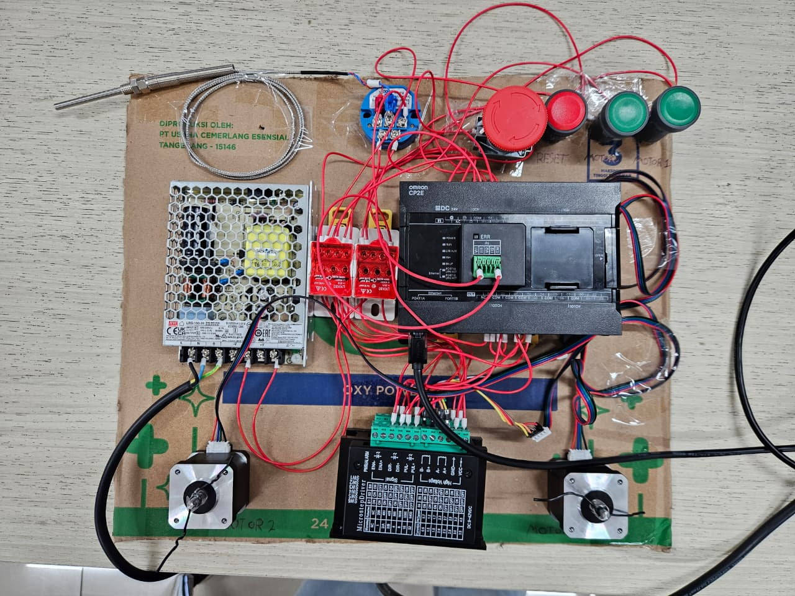
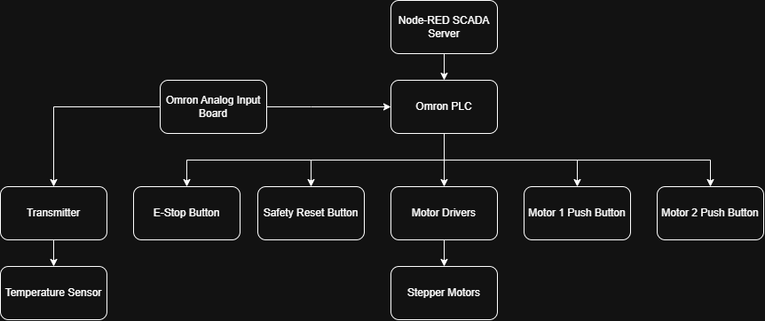
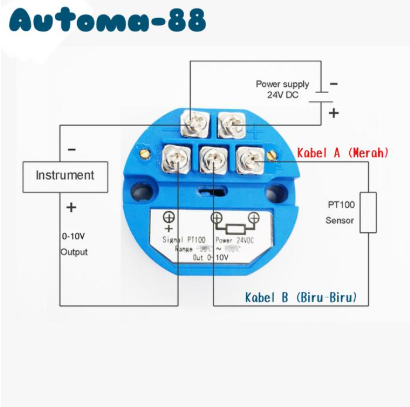

# PLC System

## System Overview
The PLC System utilizes a Node-RED SCADA Server that communicates with an Omron CP2E PLC over Ethernet. The Omron PLC acts as the central controller for the field instrumentation, processing inputs from push buttons, an emergency stop, and a PT100 temperature sensor, while driving NEMA 17 stepper motors via TB6600 motor drivers.

## System Topology
Node-RED SCADA Server -> Omron PLC -> (Transmitter, E-Stop Button, Safety Reset Button, Motor Drivers, Motor 1 Push Button, Motor 2 Push Button, Temperature Sensor, Stepper Motors)

## Components Used
* AC Power Cable
* Mean Well PSU
* VCC Bus Bar
* GND Bus Bar
* Omron CP2E PLC
* XB7-EA31 Push Button (Green Motor 1, Green Motor 2, Red Safety Reset)
* XB2BS542C Emergency Button
* PT100 Transmitter
* CP1W-ADB21 Option Board
* TB6600 Driver (x2)
* PT100 Sensor Probe
* NEMA 17 Motor (x2)
* SCADA Server (PC)

## IP Configuration

| Device | IP Address | Subnet Mask | Gateway | Connection Method | How to Configure |
| :--- | :--- | :--- | :--- | :--- | :--- |
| SCADA Server (Host Server) | 10.20.20.5 | 255.255.255.0 | 10.20.20.1 | Wireless to Company Wifi | Set from Server |
| Omron CP2E PLC | 10.20.20.6 | 255.255.255.0 | 10.20.20.1 | Wired to Ethernet Switch | CX-Programmer -> Settings -> Built-in Ethernet -> Set Static IP |

## Wiring Table

### 1. Power
| SOURCE COMPONENT | SOURCE TERMINAL | DESTINATION COMPONENT | DESTINATION TERMINAL |
| :--- | :--- | :--- | :--- |
| AC Power Cable | Live (Brown or Black wire) | Mean Well PSU | L screw |
| AC Power Cable | Neutral (Blue wire) | Mean Well PSU | N screw |
| AC Power Cable | Ground (Yellow or Green wire) | Mean Well PSU | FG screw |
| Mean Well PSU | V+ Screw | VCC Bus Bar | Terminal Screw |
| Mean Well PSU | V- Screw | GND Bus Bar | Terminal Screw |
| VCC Bus Bar | Terminal | Omron CP2E PLC | L+ Screw |
| GND Bus Bar | Terminal | Omron CP2E PLC | M- Screw / COM |
| VCC Bus Bar | Terminal | All XB7-EA31 Push Button | C Output Terminal |
| VCC Bus Bar | Terminal | XB2BS542C Emergency Button | C Output Terminal |
| VCC Bus Bar | Terminal | PT100 Transmitter | V+ |
| GND Bus Bar | Terminal | PT100 Transmitter | V- |
| GND Bus Bar | Terminal | CP1W-ADB21 Board | COM 1 |
| VCC Bus Bar | Terminal | TB6600 Driver 1 | VCC |
| GND Bus Bar | Terminal | TB6600 Driver 1 | GND |
| VCC Bus Bar | Terminal | TB6600 Driver 2 | VCC |
| GND Bus Bar | Terminal | TB6600 Driver 2 | GND |
| VCC Bus Bar | Terminal | TB6600 Driver 1 | PUL+(Pulse) & DIR+(Direction) |
| VCC Bus Bar | Terminal | TB6600 Driver 2 | PUL+(Pulse) & DIR+(Direction) |

### 2. Signal & Communication
| SOURCE COMPONENT | SOURCE TERMINAL | DESTINATION COMPONENT | DESTINATION TERMINAL |
| :--- | :--- | :--- | :--- |
| Green Motor 1 XB7-EA31 Push Button | NO Output Terminal | Omron CP2E PLC | Input 0.00 |
| Green Motor 2 XB7-EA31 Push Button | NO Output Terminal | Omron CP2E PLC | Input 0.03 |
| Red Safety Reset XB7-EA31 Push Button | NO Output Terminal | Omron CP2E PLC | Input 0.02 |
| XB2BS542C Emergency Button | Terminal 12 (NC Output) | Omron CP2E PLC | Input 0.01 |
| PT100 Sensor Probe | 3-Wire Leads Blue-Blue, Red | PT100 Transmitter | RTD / PT100 Terminals |
| PT100 Transmitter | Bottom-left Terminal (Signal) | CP1W-ADB21 Option Board | Vin 1 |
| Omron CP2E PLC | Output 0.00 (Transistor PTO) | TB6600 Driver 1 | PUL-(Pulse) |
| Omron CP2E PLC | Output 0.02 (Transistor PTO) | TB6600 Driver 1 | DIR-(Direction) |
| Omron CP2E PLC | Output 0.01 (Transistor PTO) | TB6600 Driver 2 | PUL-(Pulse) |
| Omron CP2E PLC | Output 0.03 (Transistor PTO) | TB6600 Driver 2 | DIR-(Direction) |
| TB6600 Driver 1 | A+ / A- / B+ / B- | NEMA 17 Motor 1 | Black(A+) / Green(A-) / Red(B+) / Blue(B-) Wire |
| TB6600 Driver 2 | A+ / A- / B+ / B- | NEMA 17 Motor 2 | Black(A+) / Green(A-) / Red(B+) / Blue(B-) Wire |
| Omron CP2E PLC | COM (Output) | Omron CP2E PLC | 2x COM (Output) |
| SCADA Server (PC) | Ethernet Port (RJ45) | Omron CP2E PLC | Ethernet Port (RJ45) |

### 3. TB6600 Driver Configuration
For both TB6600 drivers, the DIP switches (SW1-SW6) are set to: **OFF - ON - OFF - ON - ON - OFF**.
- **SW1 to SW3 (OFF, ON, OFF)**: Sets Microstep to **8** and Pulse/rev to **1600**. This gives a good balance of high precision and smooth rotation without exceeding the PLC's high-speed pulse output limit.
- **SW4 to SW6 (ON, ON, OFF)**: Sets output Current to **1.5A** and Peak Current to **1.7A**. This safely matches the NEMA 17 motor's current rating, providing maximum torque without overheating or damaging the motor coils.

### 4. PT100 Transmitter Wiring

The PT100 temperature transmitter requires careful wiring to ensure accurate analog readings at the PLC.

**1. PT100 Sensor Probe (Input to Transmitter - Bottom Terminals):**
*   **Red Wire:** Connects to the **bottom-right terminal**.
*   **Blue Wires (Both):** Connect to the **bottom-middle terminal**.

**2. Power Supply (Power to Transmitter - Top Terminals):**
*   **24V+ (VCC):** Connects from the VCC Bus Bar (24V DC) to the **top-right terminal**.
*   **0V (GND):** Connects from the GND Bus Bar to the **top-left terminal**.

**3. Analog Signal (Output to PLC Option Board):**
*   **Signal Output (0-10V):** Connects from the **bottom-left terminal** to the **Vin 1** terminal on the **Omron CP1W-ADB21 Option Board**.
*   **Signal Ground (COM):** Connects from the **top-left terminal** (GND) to the **COM** terminal on the **GND Bus Bar** to complete the analog circuit loop.

## Protocols & Data Mapping

### 1. Protocols & Ports
* **Omron CP2E PLC**: Modbus TCP Server (Port 502)
* **SCADA Server (Node-RED)**: HTTP Web Server (Port 1880)

### 2. Modbus Register Mapping

The Modbus addresses map directly to the internal memory areas in the Omron CP2E PLC (configured in CX-Programmer):
*   **Coils (0x) map to W (Work Area) Bits:** The formula is `(Word Number × 16) + Bit Number = Modbus Coil`.
    *   *Example:* `W0.01` is Coil `1` `(0 × 16 + 1)`.
    *   *Example:* `W1.00` is Coil `16` `(1 × 16 + 0)`.
    *   *Example:* `W1.04` is Coil `20` `(1 × 16 + 4)`.
*   **Holding Registers (4x) map to D (Data) Registers:** The address is a direct 1-to-1 match.
    *   *Example:* `D100` is Holding Register `100`.
    *   *Example:* `D1024` is Holding Register `1024`.

| Register Type | Address | Data Description |
| :--- | :--- | :--- |
| Coil (0x) | 1 | E-Stop Command |
| Coil (0x) | 2 | Safety Reset Command |
| Coil (0x) | 3 | Physical Field E-Stop Status |
| Coil (0x) | 4 | Master Safety Latch Bit |
| Coil (0x) | 5 | Motor 1 Running Status |
| Coil (0x) | 6 | Motor 2 Running Status |
| Coil (0x) | 7 | Field Button Status |
| Coil (0x) | 16 | Motor 1 Enable Command |
| Coil (0x) | 17 | Motor 2 Enable Command |
| Coil (0x) | 18 | Motor 1 Direction Command |
| Coil (0x) | 19 | Motor 2 Direction Command |
| Coil (0x) | 20 | Motor 2 Field Override Badge |
| Holding Register (4x) | 100 | Motor 1 Speed Command (RPM) |
| Holding Register (4x) | 101 | Motor 2 Speed Command (RPM) |
| Holding Register (4x) | 1024 | Temperature Raw (x100 °C) |
| Holding Register (4x) | 1025 | Speed Control Setpoint |
| Holding Register (4x) | 1026 | Calculated Thermal Auto-Speed |

## Software Setup & Execution Walkthrough

### 1. Omron CP2E PLC Programming
1. **Install CX-Programmer**: Download and install OMRON CX-One, which includes CX-Programmer.
2. **Open the Project**: Launch CX-Programmer and open `OmronSCADA_CXProgrammer.cxp`.
3. **Configure Network**: Go to PLC settings and configure the PLC's IP address to match your network (e.g., `192.168.2.xxx`).
4. **Compile and Download**: 
   - Compile the program (Ctrl+F7).
   - Go online with the PLC (Ctrl+W).
   - Download the program to the PLC (Program > Transfer > To PLC).
5. **Run Mode**: Switch the PLC into Run/Monitor mode to start execution.

### 2. SCADA Server (Node-RED)
1. **Start Node-RED**: Open command prompt on your SCADA laptop and type `node-red`.
2. **Import Flow**: 
   - Open browser and go to `http://localhost:1880`.
   - Click the menu (hamburger icon) > Import.
   - Select `node-REDFlow.json` from the `PLC System` directory.
   - Click Import.
3. **Configure Nodes**: Update the Modbus nodes within the flow to point to the Omron PLC's IP address.
4. **Modbus Function Codes (FC) Used in Node-RED**:
   - **FC 1 (Read Coils)**: Reads boolean bits (e.g., checking if motor is running or button is pressed).
   - **FC 3 (Read Holding Registers)**: Reads integer/analog values (e.g., reading PT100 temperature).
   - **FC 5 (Force Single Coil)**: Writes a single boolean bit (e.g., sending E-Stop or motor toggle command).
   - **FC 6 (Preset Single Register)**: Writes a single integer value (e.g., sending motor speed command).
5. **Deploy**: Click the Deploy button to apply the changes and start the SCADA interface.

## System Operation Walkthrough

1. **Safety Lockout System (Reset)**: The PLC features a hardcoded Safety Lockout mechanism. Before any operation can begin, ensure the physical red XB2 E-Stop button is released (pulled out). You MUST press the physical Red Safety Reset XB7 button to clear the Master Safety Lockout Latch in the PLC. Motors will not spin while this latch is engaged.
2. **Access Dashboard**: Open a web browser on the SCADA Server and navigate to `http://localhost:1880/ui` to access the Node-RED HMI.
3. **Motor Control**: You can control the motors (Enable, Direction, Speed) directly from the HMI, or use the physical Green XB7 buttons in the field to toggle the motors on/off.
4. **Thermal Monitoring**: The PT100 sensor provides real-time temperature feedback. The SCADA system will log this data to IoTDB and can adjust Motor 2's speed if the thermal ramp triggers.
5. **Emergency Stop**: In case of an emergency, press the physical field E-Stop button or click the Emergency Stop button on the HMI dashboard to immediately halt all operations.

## System Power Up & Shutdown Procedures

### Power On Procedure
1. Boot the SCADA Server Laptop and start Node-RED.
2. Plug in the AC Power Cable to energize the Mean Well PSU. This will supply 24V DC to the VCC Bus Bar, powering the Omron CP2E PLC, PT100 Transmitter, TB6600 Drivers, and all Field Buttons.
3. Wait for the Omron PLC to finish booting and enter RUN/MONITOR mode.
4. Verify the Node-RED dashboard indicates active connection and telemetry.

### Power Off Procedure
1. Ensure the E-Stop is pressed or all motors are commanded to a full stop via the Node-RED dashboard.
2. Unplug the AC Power Cable to de-energize the Mean Well PSU, safely cutting power to the PLC, drivers, and sensors simultaneously.
3. Stop Node-RED on the SCADA Server.

## Maintenance & Restore to Baseline (Penetration Testing)
Since this system is used for penetration testing, components may be compromised, misconfigured, or crashed. Use the following procedures to restore the system to a clean baseline.

### 1. Omron CP2E PLC (via CX-Programmer)
* **Maintenance**: Regularly back up the `.cxp` project file before testing. Verify that the physical Safety Reset button is functioning correctly.
* **Restore to Baseline**:
  1. Connect your secure laptop to the Omron PLC via Ethernet or USB.
  2. Open the clean `OmronSCADA_CXProgrammer.cxp` project in CX-Programmer.
  3. Go Online with the PLC (Ctrl+W).
  4. Switch the PLC to PROGRAM mode to halt execution.
  5. Download the clean program to the PLC (Program > Transfer > To PLC).
  6. Switch back to RUN/MONITOR mode. This purges any rogue ladder logic or manipulated memory states injected by attackers.
