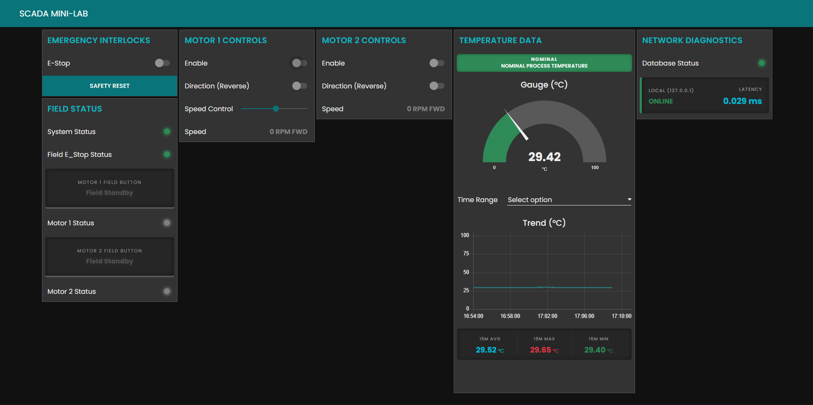

# Mini-SCADA-System

Welcome to the Mini SCADA System repository. This project is divided into two main components:
- [PLC System](./PLC%20System/README.md)
- [Raspberry System](./Raspberry%20System/README.md)

Please refer to the respective directories for detailed documentation on wiring.

## SCADA HMI Overview


## Setup Node-RED and IoTDB with Docker

1. **Install Docker**
   Make sure Docker and Docker Compose are installed on your machine.
2. **Run Docker Compose**
   Open command prompt in the root of this project and run:
   ```bash
   docker-compose up -d
   ```
3. **Access Node-RED Editor**
   Open your browser and navigate to `http://localhost:1880`.
4. **Access IoTDB**
   You can connect to IoTDB at `localhost:6667`.

To stop the services, run:
```bash
docker-compose down
```

## Maintenance & Restore to Baseline (Penetration Testing)
Since this system is used for penetration testing, components may be compromised, misconfigured, or crashed. Use the following procedures to restore the central servers to a clean baseline.

### 1. Node-RED (SCADA HMI)
* **Maintenance**: Monitor the Node-RED debug tab for unauthorized flow injections or HTTP endpoint abuse.
* **Restore to Baseline**:
  1. Open the Node-RED editor at `http://localhost:1880`.
  2. Select all existing nodes (Ctrl+A) and delete them.
  3. Click Menu > Import and select the clean `node-REDFlow.json` from either the `PLC System` or `Raspberry System` directory, depending on the active test scenario.
  4. Click **Deploy** to overwrite any compromised flows or rogue UI elements.

### 2. IoTDB (Historian Database)
* **Maintenance**: Use the IoTDB CLI to periodically monitor storage size and active sessions. Because it runs in Docker, use this command to access the CLI:
  ```bash
  docker-compose exec iotdb /iotdb/sbin/start-cli.sh -h 127.0.0.1 -p 6667 -u root -pw root
  ```
* **Backup Data**: Before a test, back up the database data by creating a copy of the Docker volume or mapping a local host directory to `/iotdb/data` in your `docker-compose.yml` and backing up that folder.
* **Restore to Baseline**:
  1. Run `docker-compose down` to stop the database.
  2. Delete the IoTDB data directory or Docker volume to completely wipe the manipulated database state.
  3. Run `docker-compose up -d` to spin up a fresh, clean instance of IoTDB.
  4. *(Optional)* If restoring from a specific backup, copy your backed-up data folder into the mapped directory before starting the container.
