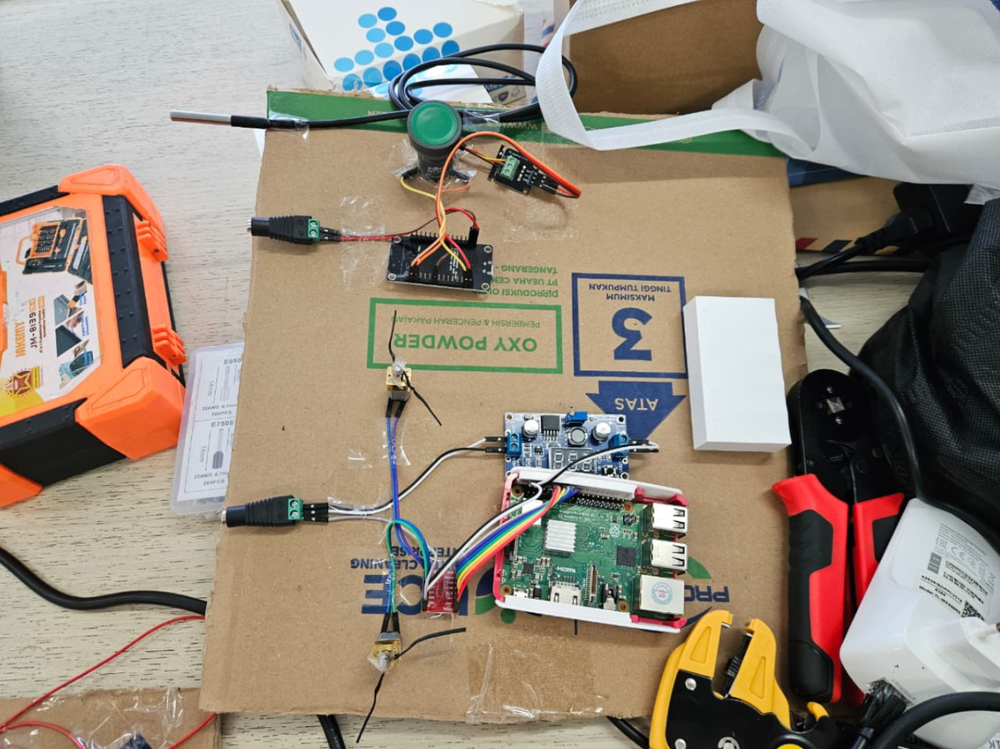
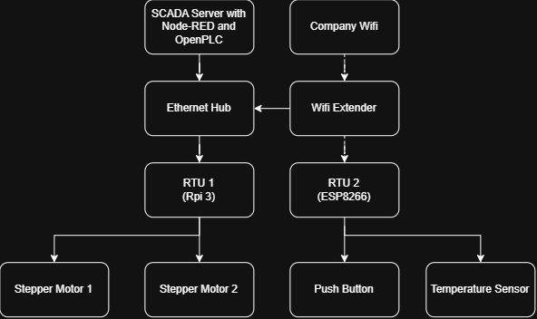

# Raspberry System

## System Overview
The Raspberry System features a SCADA architecture where a laptop running Node-RED acts as the host server. It communicates over a network (Ethernet and Wi-Fi) with two Remote Terminal Units (RTUs): a Raspberry Pi 3 (RTU 1) and an ESP8266 (RTU 2). These RTUs directly interface with N20 micro DC motors via a TB6612FNG driver, a DS18B20 temperature sensor, and digital push buttons.


## System Topology
Laptop SCADA Server (Node-RED) -> Ethernet Hub & Wi-Fi Extender -> RTU 1 (Raspberry Pi 3) & RTU 2 (ESP8266) -> Stepper Motors, Push Button, Temperature Sensor


## Components Used
* 12V DC Adapter
* 5V DC Adapter
* LM2596 Buck Converter
* TB6612FNG Motor Driver
* Raspberry Pi 3
* ESP8266 Dev Module
* N20 Motor (x2)
* XB7 Push Button
* DS18B20 Temp Sensor

## Wiring Table

### 1. Power
| SOURCE COMPONENT | SOURCE TERMINAL | DESTINATION COMPONENT | DESTINATION TERMINAL |
| :--- | :--- | :--- | :--- |
| 12V DC Adapter | Positive (+) | LM2596 Buck Converter | IN+ |
| 12V DC Adapter | Negative (-) / GND | LM2596 Buck Converter | IN- |
| 12V DC Adapter | Positive (+) | TB6612FNG Motor Driver | VM |
| LM2596 Converter | OUT+ (Set to 5.0V) | Raspberry Pi 3 | Pin 2 or 4 (5V) |
| LM2596 Converter | OUT- (GND) | Raspberry Pi 3 | Pin 6 (GND) |
| 5V DC Adapter | Positive (+) | ESP8266 Dev Module | VIN / 5V |
| 5V DC Adapter | Negative (-) / GND | ESP8266 Dev Module | GND |

### 2. RTU 1: Raspberry Pi 3 -> TB6612FNG Dual DC Motor Driver
| Raspberry Pi 3 Pin | TB6612FNG Pin |
| :--- | :--- |
| Pin 2 or 4 (5V) | VCC |
| Pin 6 (GND) | GND |
| GPIO 17 | PWMA |
| GPIO 18 | AIN1 |
| GPIO 27 | AIN2 |
| GPIO 22 | STBY |
| GPIO 23 | PWMB |
| GPIO 24 | BIN1 |
| GPIO 25 | BIN2 |

### 3. Motor Driver -> N20 Micro DC Motors Output
| TB6612FNG Terminal | Target Component | Wire Connection |
| :--- | :--- | :--- |
| A01 | N20 Motor 1 | Terminal 1 (Red) |
| A02 | N20 Motor 1 | Terminal 2 (Black) |
| B01 | N20 Motor 2 | Terminal 1 (Red) |
| B02 | N20 Motor 2 | Terminal 2 (Black) |

### 4. RTU 2: ESP8266 -> Field Inputs
| ESP8266 Pin | Connected Component | Terminal / Wire |
| :--- | :--- | :--- |
| GND | XB7 Push Button | Terminal 1 (NO) |
| GPIO 5 | XB7 Push Button | Terminal 2 (NO) |
| 3V3 | DS18B20 Temp Sensor | Red Wire (VCC) |
| GND | DS18B20 Temp Sensor | Black Wire (GND) |
| GPIO 4 | DS18B20 Temp Sensor | Yellow Wire (DATA) |

## Software Setup & Execution Walkthrough

### 1. RTU 1: Raspberry Pi 3
1. **OS Setup**: Flash Raspberry Pi OS onto a microSD card and boot up the Pi. Connect it to the network.
2. **Install Dependencies**: Open the Pi's terminal and run:
   ```bash
   sudo apt update
   sudo apt install python3 python3-pip
   pip3 install pymodbus RPi.GPIO asyncio
   ```
3. **Transfer Code**: Copy `raspiProgram.py` to the Raspberry Pi (e.g., `/home/pi/`).
4. **Run Script**: Execute the script via terminal: `python3 /home/pi/raspiProgram.py`.

### 2. RTU 2: ESP8266
1. **Install Arduino IDE**: Download and install the Arduino IDE on your development laptop.
2. **Install ESP8266 Board**: 
   - Go to File > Preferences and add `http://arduino.esp8266.com/stable/package_esp8266com_index.json` to Additional Boards Manager URLs.
   - Go to Tools > Board > Boards Manager, search for `esp8266`, and install it.
3. **Install Libraries**: In Library Manager (Tools > Manage Libraries), install:
   - `OneWire`
   - `DallasTemperature`
   - `ModbusIP_ESP8266`
4. **Flash Firmware**: Open `esp8266Program.cpp`, adjust the WiFi credentials (`YOUR_WIFI_SSID` / `YOUR_WIFI_PASSWORD`), select your ESP8266 board under Tools, and click Upload.

### 3. RTU 3: OpenPLC
1. **Install OpenPLC Editor**: Download and install OpenPLC Editor on your laptop.
2. **Upload Code**: Open `OpenPLCProgram.st` in the editor, compile it, and transfer it to your OpenPLC runtime device.

### 4. SCADA Server (Node-RED)
1. **Start Node-RED**: Run `node-red` on your SCADA laptop.
2. **Import Flow**: 
   - Go to `http://localhost:1880`.
   - Menu > Import, then select `node-REDFlow.json` from the `Raspberry System` directory.
3. **Configure Network**: Ensure Node-RED Modbus nodes match the static IPs of the Raspberry Pi (`192.168.2.220`) and ESP8266 (`192.168.2.230`).
4. **Deploy**: Click the Deploy button.
